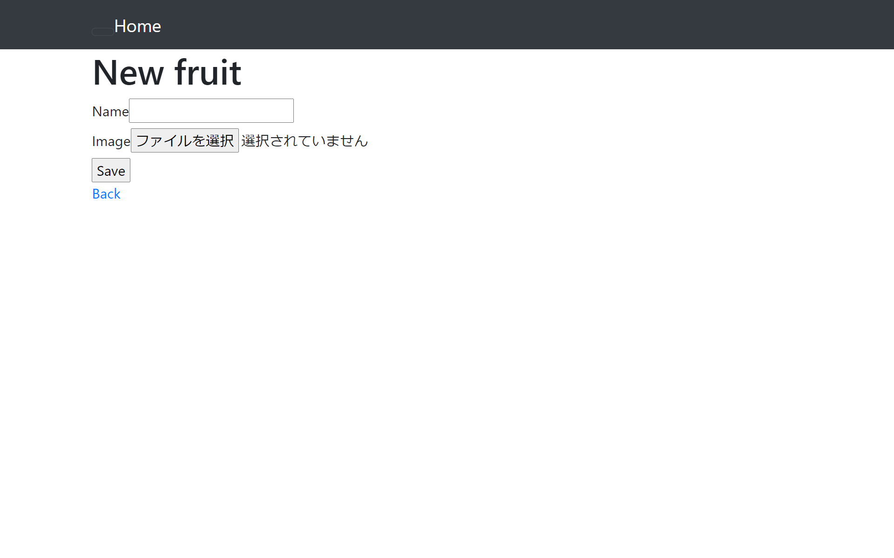
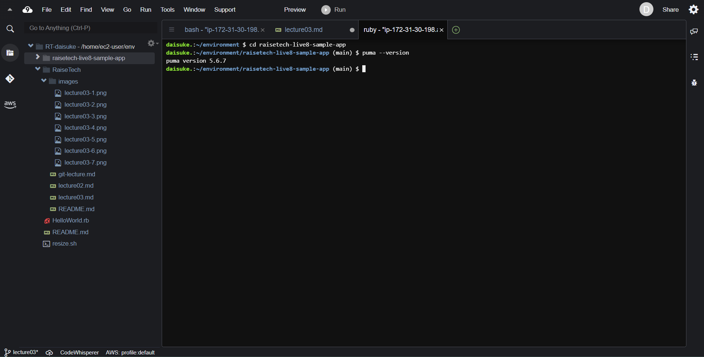
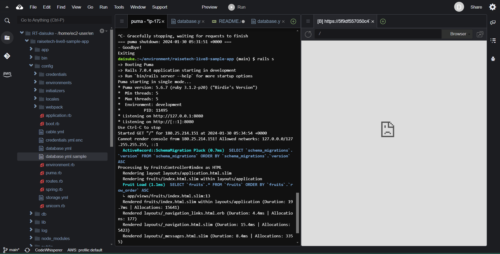
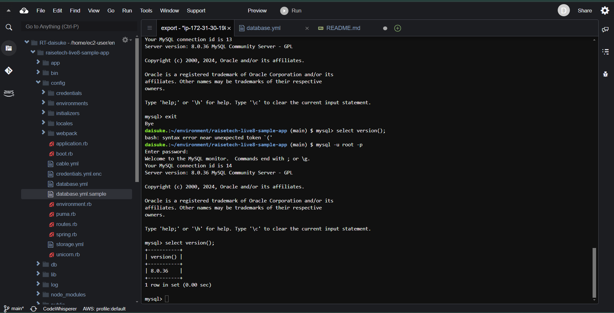
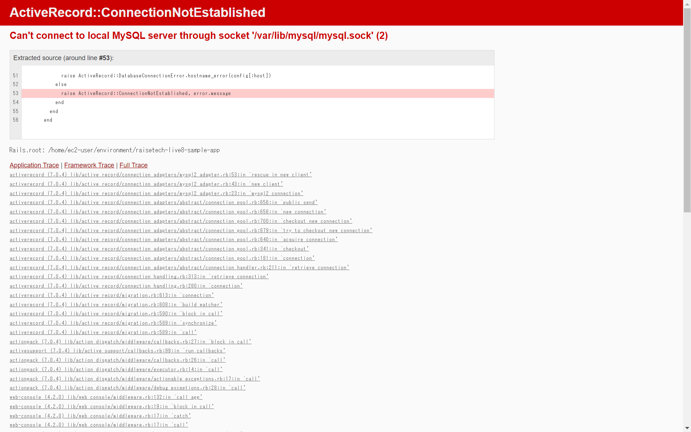
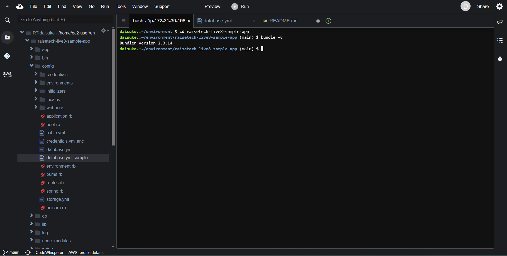

# 第3回課題
### サンプルアプリケーションの起動

- Webブラウザでの接続確認

### APサーバー
- APサーバーの名前とバージョンの確認

- APサーバーを終了させた場合

- APサーバーを再度起動

### DBサーバー

- DBサーバーの名前とバージョンの確認

- DBサーバーを終了させた場合

- Railsの構成管理ツールの名前

### 課題から学んだこと、感じたこと
#### 課題で学んだこと、感じたことを箇条書きでまとめさせていただきました。

##### 学んだこと
- DBサーバーはDBをインストールしても、すでにインストールされいているDBがある場合はそのDBを削除しないと正しく動作しない。
- アプリケーションデプロイさせるにはAPサーバーとDBサーバーの両方が必須で、APサーバーとDBサーバーが起動してないとアプリケーションは起動しない。
- Markdownファイルに画像挿入するには、Cloud9で画像フォルダーを作成しPCから作成した画像フォルダーにアップロードすることで可能になる。

##### 感じたこと
- アプリケーションのデプロイ作業はゼロから作業すると難しく感じたが、