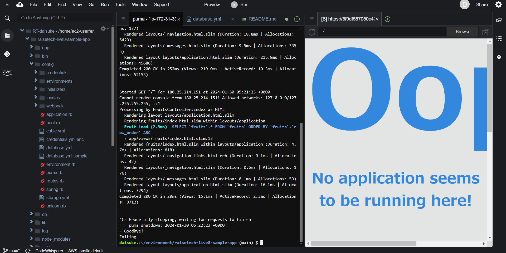

# 第3回課題
### サンプル アプリケーションの起動

- Webブラウザでの接続確認

### APサーバー
- APサーバーの名前とバージョンの確認

- APサーバーを終了させた場合

- APサーバーを再度起動と動作確認

### DBサーバー

- DBサーバーの名前とバージョンの確認

- DBサーバーを終了させた場合

- Railsの構成管理ツールの名前

### 課題から学んだこと、感じたこと
##### 課題で学んだこと、感じたことを箇条書きでまとめさせていただきました。

##### 学んだこと
- DBサーバーはDBをインストールしてもすでにインストールされいているDBがある場合は、そのDBを削除しないと新しくインストールしたDBは起動しない。
- アプリケーションを起動させるにはAPサーバーとDBサーバーの両方が必須。APサーバーとDBサーバーが起動していないとアプリケーションは起動できない。
- Cloud9に画像を保存する方法。Cloud9で画像フォルダを作成しPCに保存してある画像を、Cloud9で作成した画像フォルダにアップロードするとできる。

##### 感じたこと
- アプリケーションのデプロイ作業はゼロから作業すると表示されるメッセージの把握や理解などもあり難しく感じていたが、作業後だとデプロイ作業が割とシンプルな作業だと思えた。