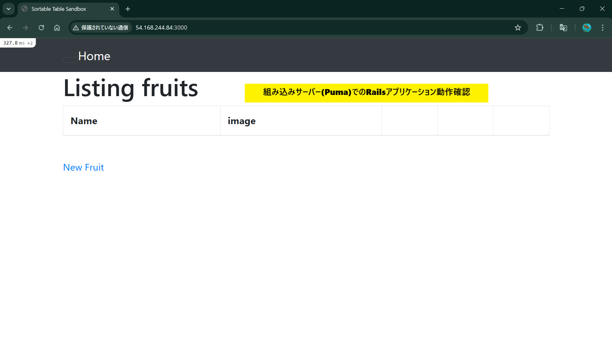
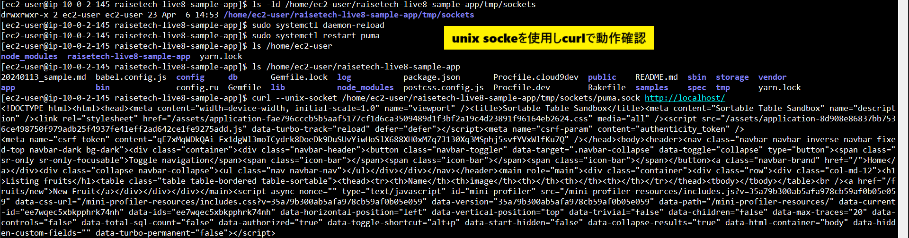
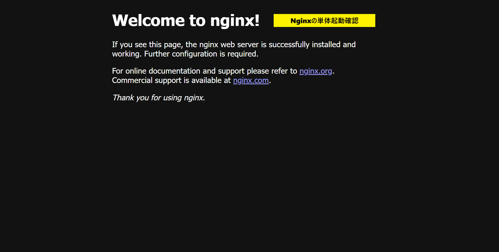
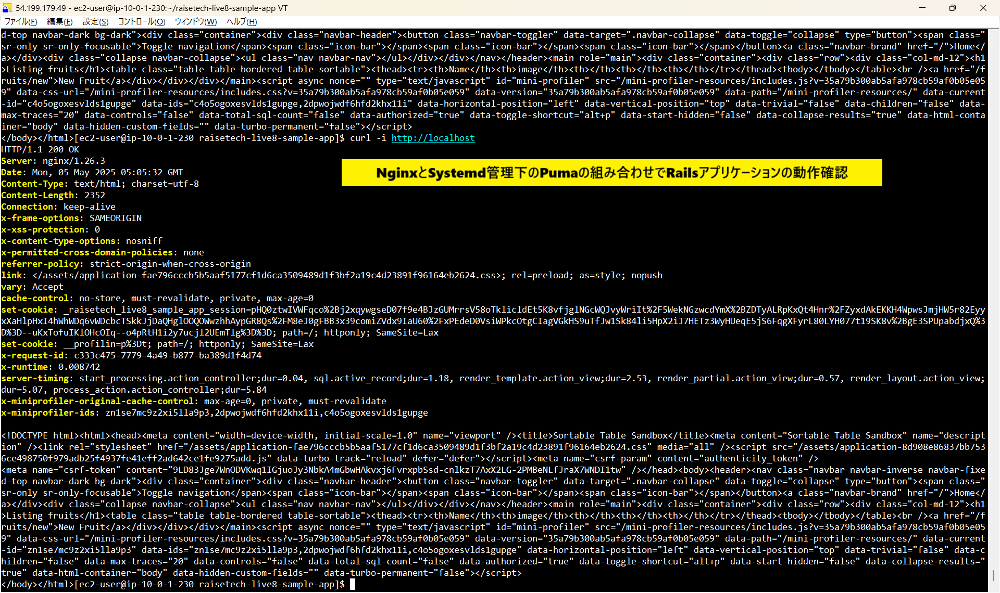
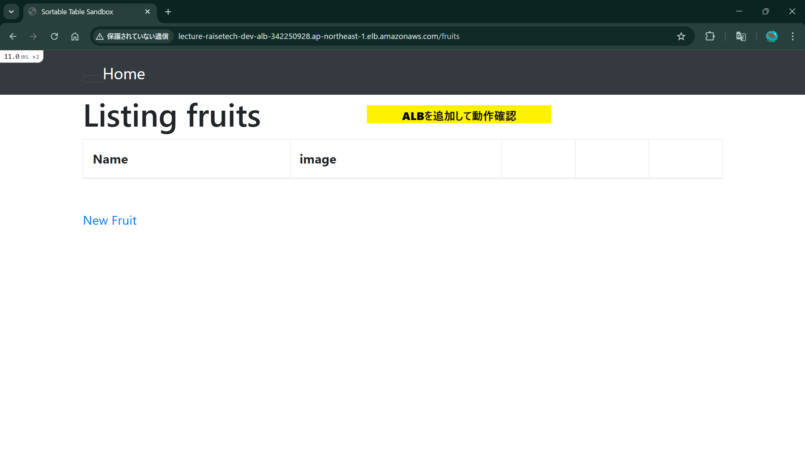
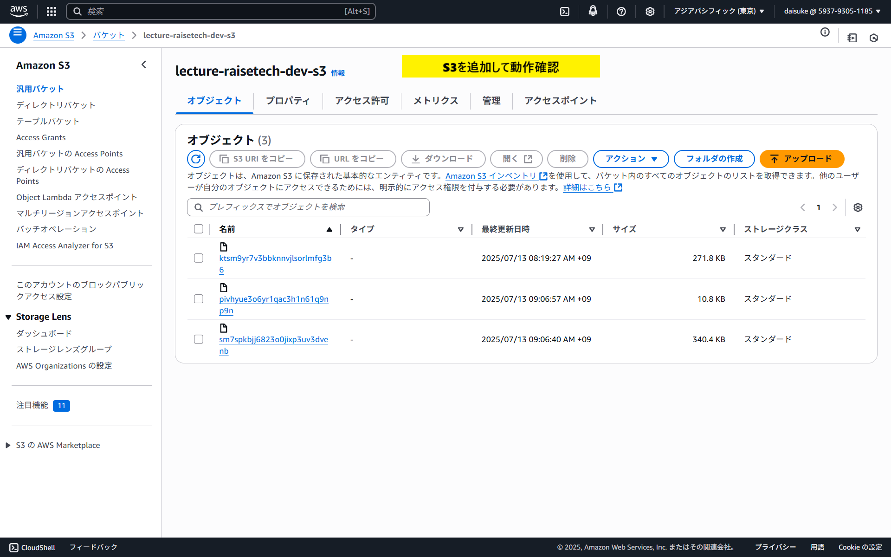
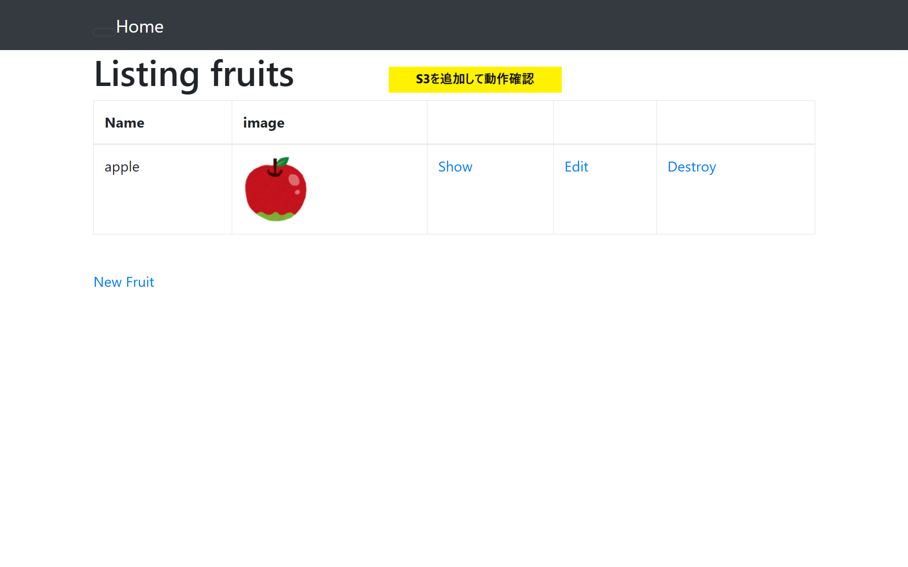
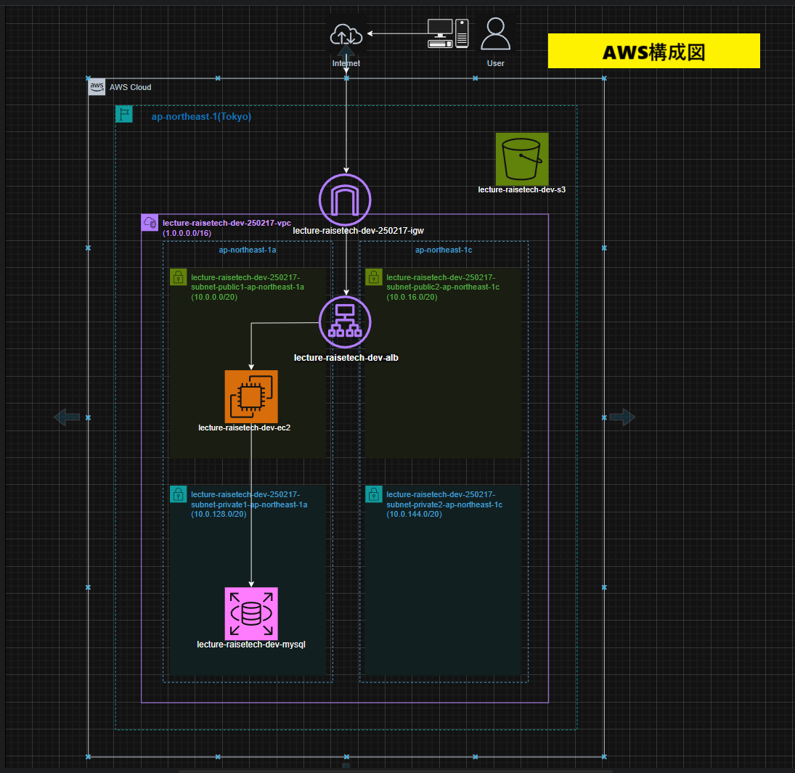

# 第5回課題

### 組み込みサーバー(Puma)でのRailsアプリケーション動作確認

### unix sockeを使用しで動作確認

### Nginxの単体起動確認

### Nginxと組み込みサーバー、Unix Socketを組み合わせてのRailsアプリケーション動作確認

### ALBを追加して動作確認

### S3を追加して動作確認

### AWS構成図

