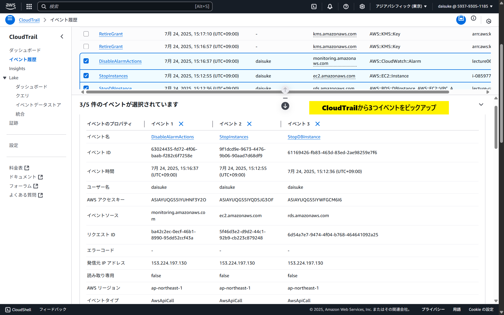
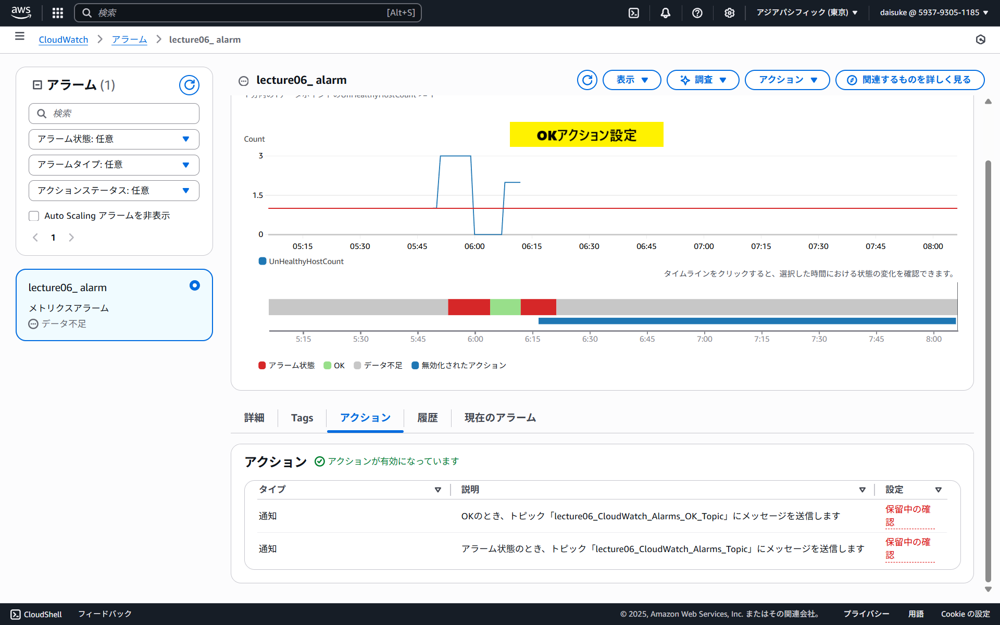
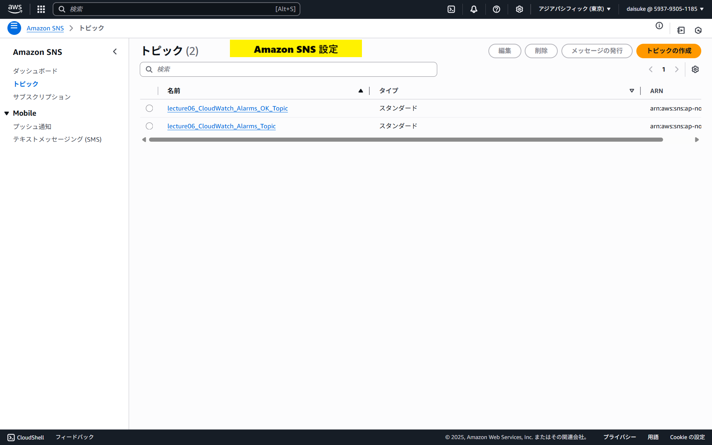
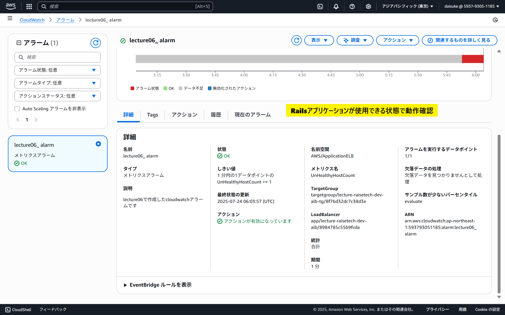
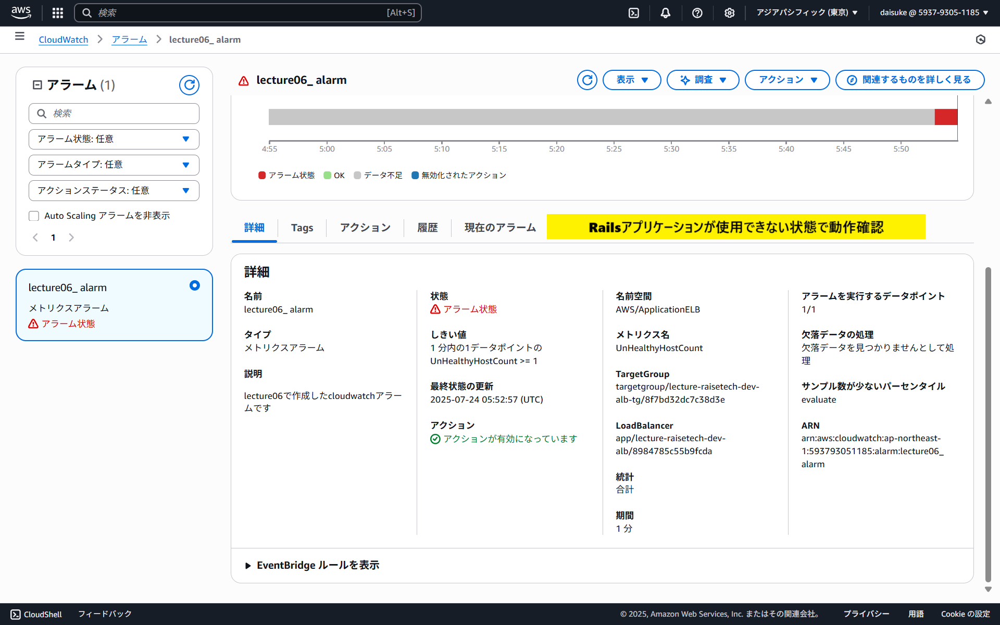
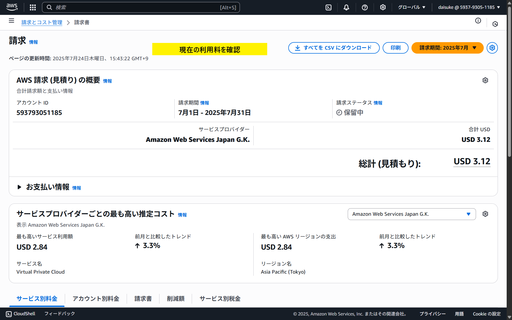
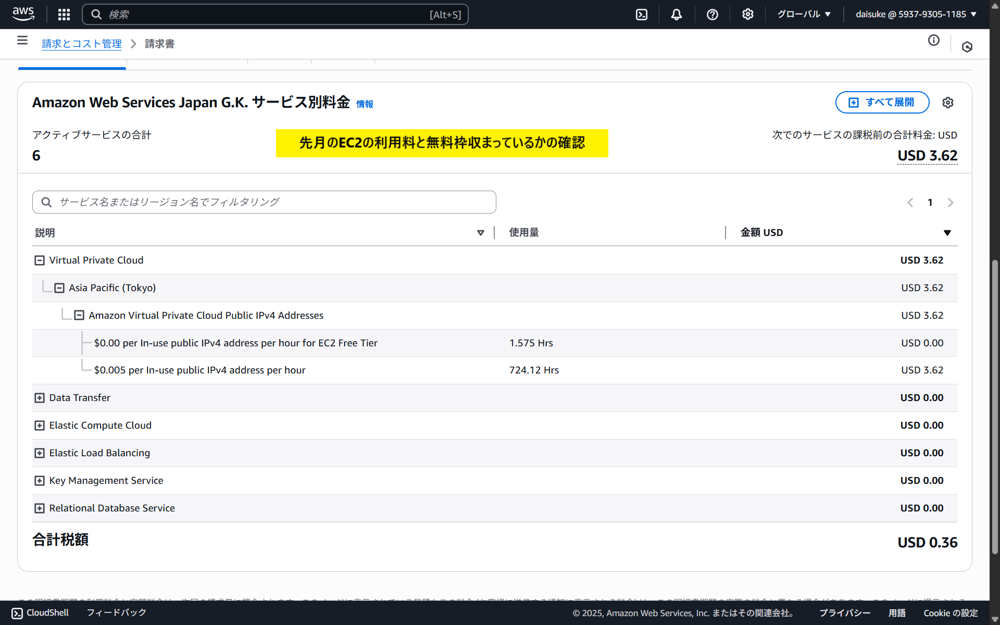

# 第6回課題

### CloudTrail のイベントからイベント名と、含まれている内容3つをピックアップ

###  CloudWatchアラームを使ってALB のアラームを設定

### マネジメントコンソールから利用料を確認

### AWS利用料の見積を作成

https://calculator.aws/#/estimate?id=7b2c5fa0e9918817bb848d4d8594b04867c89a28