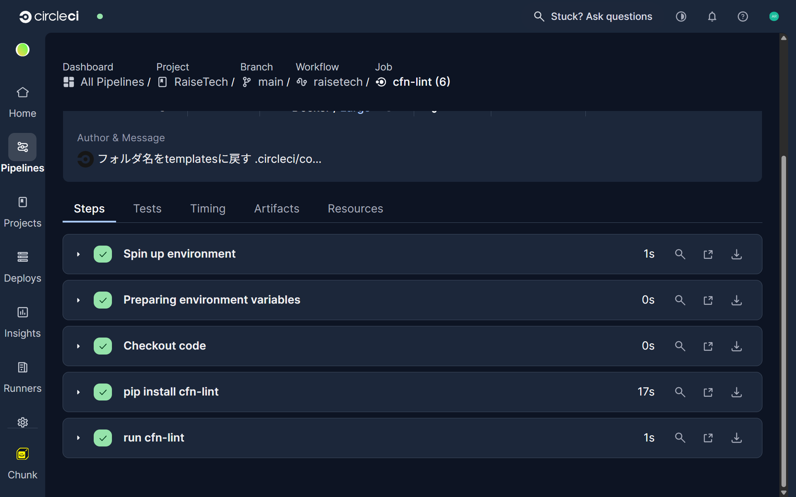

# 第12回課題

### .circleci/config.yml

[.circleci/config.yml](/.circleci/config.yml)

### circleciのパイプラインでcfn-lintの実行結果

### 実行ログへのリンクを記載

[CircleCI 実行ログはこちら](https://app.circleci.com/pipelines/circleci/5yqRmomGxEF98JLra8cwCH/DTkXGQGSTf2n45aJZqVv5c/13/workflows/ec2929c2-6876-4caa-9cc1-ef4309ff387f/jobs/13)
