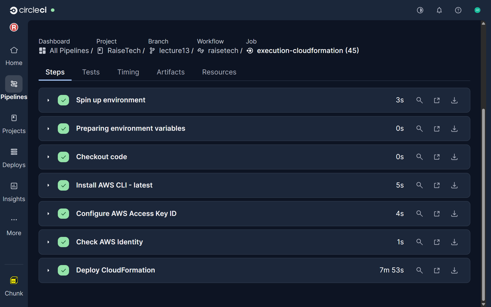
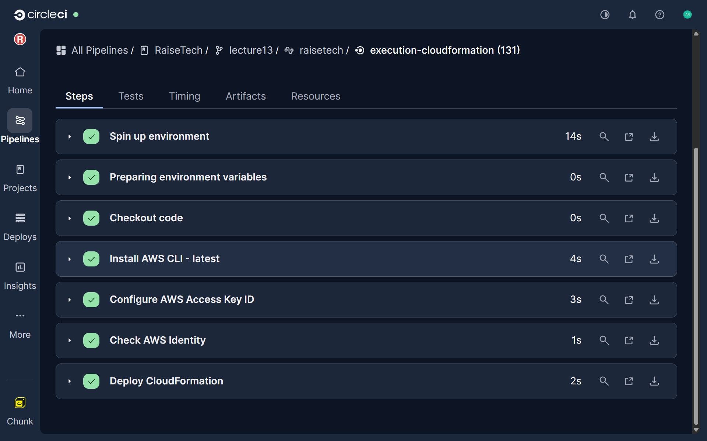
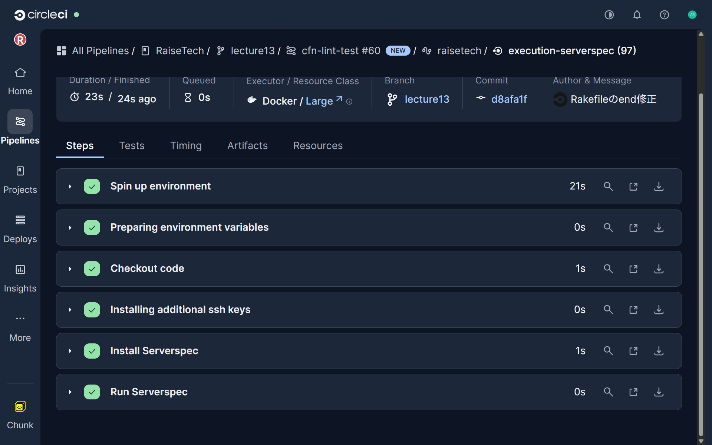

# 第13回課題

## CircleCIのサンプルにCloudfomationとServerSpecとAnsibleの処理を追加する

- [ServerSpecとAnsibleの処理を追加した .circleci/config.yml](.circleci/config.yml)

### CircleCIでCloudfomationを実行

#### 実行結果

- [cloudfomationのテンプレート](templates/multi-resource.yml)

#### cloudfomationの実行ログ
- [cloudfomationの実行ログ](https://app.circleci.com/pipelines/circleci/5yqRmomGxEF98JLra8cwCH/DTkXGQGSTf2n45aJZqVv5c/70/workflows/747a3d4e-044e-47a9-96e3-549fecb0d8a7/jobs/131)

### CircleCIでAnsibleを実行

#### Ansible実行でインストールしたモジュールとymlファイル

- [git](ansible/roles/git/tasks/main.yml)
- [nginx](ansible/roles/nginx/tasks/main.yml)
- [mysql](ansible/roles/mysql/tasks/main.yml)
- [node](ansible/roles/node/tasks/main.yml)
- [rvm](ansible/roles/rvm/tasks/main.yml)
- [bundler](ansible/roles/bundler/tasks/main.yml)

#### ansible.cfgにrolesのパス定義
 - [ansible.cfg](ansible/ansible.cfg)

#### ls -R ansible/rolesでansible/roles 配下にplaybook参照roleがあるか確認
 - [確認ログ](https://app.circleci.com/pipelines/circleci/5yqRmomGxEF98JLra8cwCH/DTkXGQGSTf2n45aJZqVv5c/70/workflows/747a3d4e-044e-47a9-96e3-549fecb0d8a7/jobs/132)

#### 実行結果

 - [inbentory](ansible/inventory/hosts.ini)

 - [playbooks](ansible/playbooks/site.yml)

 #### ansibleの実行ログ
 - [ansibleの実行ログ](https://app.circleci.com/pipelines/circleci/5yqRmomGxEF98JLra8cwCH/DTkXGQGSTf2n45aJZqVv5c/70/workflows/747a3d4e-044e-47a9-96e3-549fecb0d8a7/jobs/132)

### CircleCIでServerSpecを実行

#### 実行結果

- [target/sample_spec.rb](serverspec/spec/target/sample_spec.rb)
- [spec_helper.rb](serverspec/spec/spec_helper.rb)

- [Rakefile](serverspec/Rakefile)

#### serverspecの実行ログ
 - [serverspecの実行ログ](https://app.circleci.com/pipelines/circleci/5yqRmomGxEF98JLra8cwCH/DTkXGQGSTf2n45aJZqVv5c/70/workflows/747a3d4e-044e-47a9-96e3-549fecb0d8a7/jobs/133)

 #### CircleCIの全通ログ
- [CircleCIの全通ログ](https://app.circleci.com/pipelines/circleci/5yqRmomGxEF98JLra8cwCH/DTkXGQGSTf2n45aJZqVv5c/70)